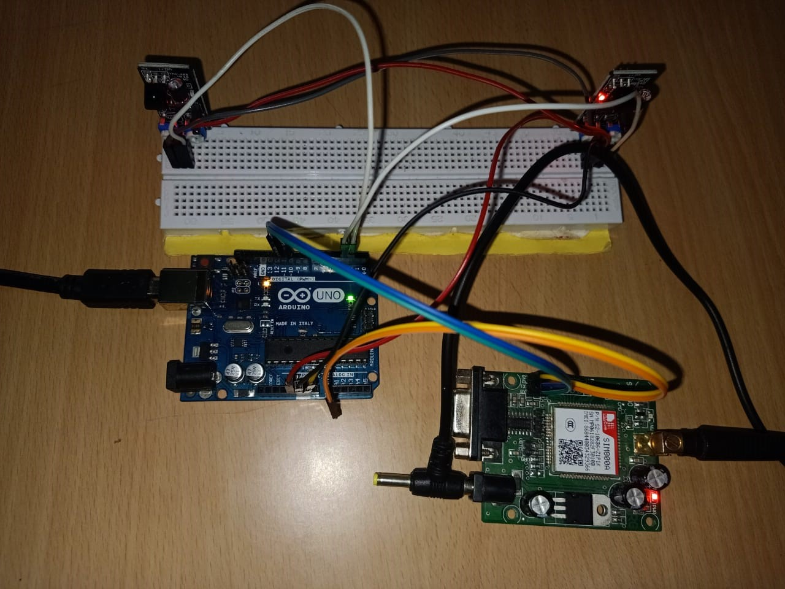

# 🚅 IoT-Based Velocity Detection and Data Transmission System

An affordable and scalable IoT solution to detect and transmit the velocity of trains. This system leverages Arduino Uno, IR sensors, LCD display, and GSM module to prevent accidents in railway system.

---

## 📌 Problem Statement

Traditional systems for monitoring train speed are either manual or based on costly technologies like RADAR or LIDAR. These systems:
- Lack real-time data transmission.
- Are expensive to deploy widely.
- Often exclude IoT integration.

This project addresses these challenges by developing a **low-cost, IoT-enabled velocity detection and GSM-based data transmission system**.

This project uses peer-to-peer network for data transmission without relying on cloud services or any centralized system.
---

## 🎯 Objectives

- 🧮 Accurately detect velocity using IR sensors and Arduino Uno.
- 📲 Transmit velocity data using a GSM module for remote monitoring.
- 📟 Provide real-time speed feedback via an LCD display.
- 💰 Ensure cost-effectiveness using easily available components.
- ✅ Validate with test objects to confirm performance and accuracy.

---

## 🧩 Components Used

| Component             | Quantity |
|----------------------|----------|
| Arduino Uno          | 2        |
| IR Sensors (KY-032)  | 4        |
| GSM Module (SIM900A) | 2        |
| LCD 16x2 with I2C    | 1        |
| Breadboards          | 2        |
| Jumper Wires         | 20       |
| USB Cable            | 2        |
| 10V Battery          | 2        |

---

## 🧠 Software Used

- **Arduino IDE** for writing, compiling, and uploading code.
- AT command-based communication for GSM integration.
- Real-time serial monitoring for debugging.

---

## ⚙️ System Architecture

### 1. Sensor System (Trackside)

- IR sensors detect object movement and measure time.
- Arduino Uno calculates speed and triggers data transmission.
- GSM module sends data to the remote receiver system.
- LCD provides immediate on-site velocity display.
#### Sensor System Image

### 2. Train-End or Central System

- GSM module receives velocity data.
- Arduino Uno processes and sends data to buzzer and LCD.
- Alerts are triggered in case of excessive speed or possible collisions.
#### Train System Image

---

## 🔌 Pin Configuration (Sensor System)

| Device        | Arduino Pins         |
|---------------|-----------------------|
| IR Sensor     | Digital Pins (e.g., D2, D3) |
| GSM Module    | TX → D10, RX → D11    |
| LCD (I2C)     | SDA → A4, SCL → A5    |
| Power Supply  | VIN, GND              |

---

## 🛠️ Setup Instructions

### 📦 Hardware Setup

1. Connect IR sensors 10–20 cm apart to measure passing time.
2. Power Arduino Uno via USB or 9–12V battery.
3. Connect GSM module’s TX/RX to Arduino using logic level shifter if needed.
4. Connect LCD (with I2C) to A4/A5 pins on Arduino.

### 💻 Software Setup

1. Install [Arduino IDE](https://www.arduino.cc/en/software).
2. Install necessary libraries (`LiquidCrystal_I2C`, `SoftwareSerial`).
3. Upload Arduino code from `/Codes/` directory.
4. Insert activated SIM card in the GSM module.

### 📶 GSM Configuration

- Use AT commands for setup: `AT`, `AT+CSQ`, `AT+CMGF=1`, etc.
- Monitor GSM response using Serial Monitor.

---

## 🚨 Features

- 🔍 Real-time speed detection using IR sensors.
- 🛰️ GSM-based wireless data transmission.
- 🔔 Buzzer alerts for over-speed detection.
- 💸 Low-cost and easily deployable system.

---

## 📁 Project Structure

- `Codes/` – Arduino code files  
- `Diagrams/` – Circuit and system diagrams  
- `Docs/` – Project report  
- `Images/` – Screenshots and visual assets  
- `LICENSE.md` – License information  
- `README.md` – Project overview and setup instructions 